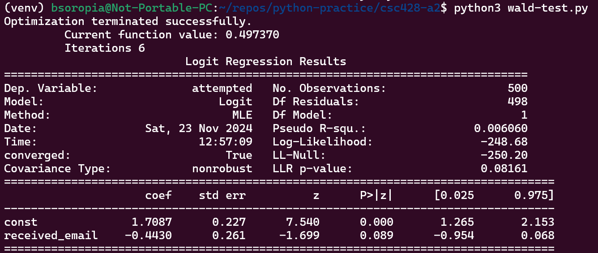

## Setup

** Requires Python 3+**

1. Start a virtual env using `python -m venv venv`
    - The second `venv` is the name of the virtual environment.
2. Active that env by doing:
    - Unix: `source myvenv/bin/activate`
    - Windows: `venv\Scripts\activate.bat # In cmd.exe` or `venv\Scripts\Activate.ps1 # In PowerShell`
3. Install dependencies: `pip install -r requirements.txt`
4. Run the Wald Test by `python wald-test.py`
    - Or if your Python3 is setup differently like me, `python3 wald-test.py`

When done, deactivate the virtual env with `deactivate  `.

## Interpreting the Wald Test Results (according to CHat GPT)

I've included the screenshot of the results when I ran the Wald Test.

Here's how Chat GPT explained the process of interpreting the results:

1. Define the Hypotheses
    - Null Hypothesis (H0​): Receiving an email does not affect the likelihood of attempting.
    - Alternative Hypothesis (HA​): Receiving an email does affect the likelihood of attempting.

To evaluate whether receiving an email (received_email) affected the likelihood of attempting (attempted), you can perform a Wald test. The Wald test is commonly used to assess the significance of predictors in a logistic regression model, which is appropriate for binary outcomes like attempted.

Here’s how to perform a Wald test step by step:
1. Define the Hypotheses
    - Null Hypothesis (H0H0​): Receiving an email does not affect the likelihood of attempting.
    - Alternative Hypothesis (H1H1​): Receiving an email does affect the likelihood of attempting.

2. Logistic Regression Model

The Wald test is a byproduct of fitting a logistic regression model, where:
- Dependent variable: `attempted` (binary: 1 = yes, 0 = no).   
- Independent variable: `received_email` (binary: 1 = yes, 0 = no).

The logistic regression model estimates the probability that a person attempts (`attempted`) given whether they received an email (`received_email`).

Results after running Code:

3. Interpret the results:
Look for the coefficient of received_email in the output.
- Check its p-value under the "P>|z|" column.
    - If the p-value is less than your significance threshold (e.g., 0.05), reject H0H0​. This means that receiving an email significantly affects the likelihood of attempting.
    - The coefficient indicates the magnitude of the effect:
        - A positive coefficient means receiving an email increases the likelihood of attempting.
        - A negative coefficient means receiving an email decreases the likelihood.

4. Key Output from the Model
- Wald Statistic: Computed as `(Coefficient/Standard Error)^2`.
    - This tests whether the coefficient is significantly different from zero.
- P-Value: Tells you if the effect is statistically significant.

6. Conclusion

The Wald test evaluates the significance of predictors (e.g., `received_email`) in your logistic regression model. A significant result (p-value < 0.05) indicates that receiving an email has a measurable impact on whether users attempt the assignment.